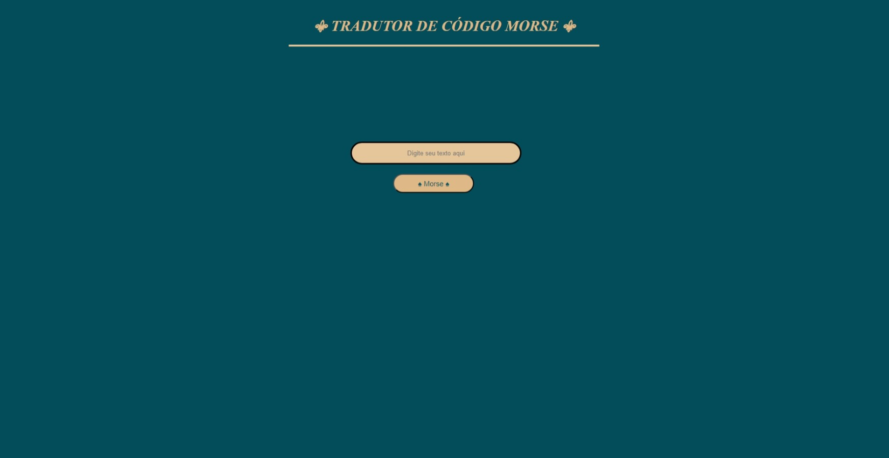
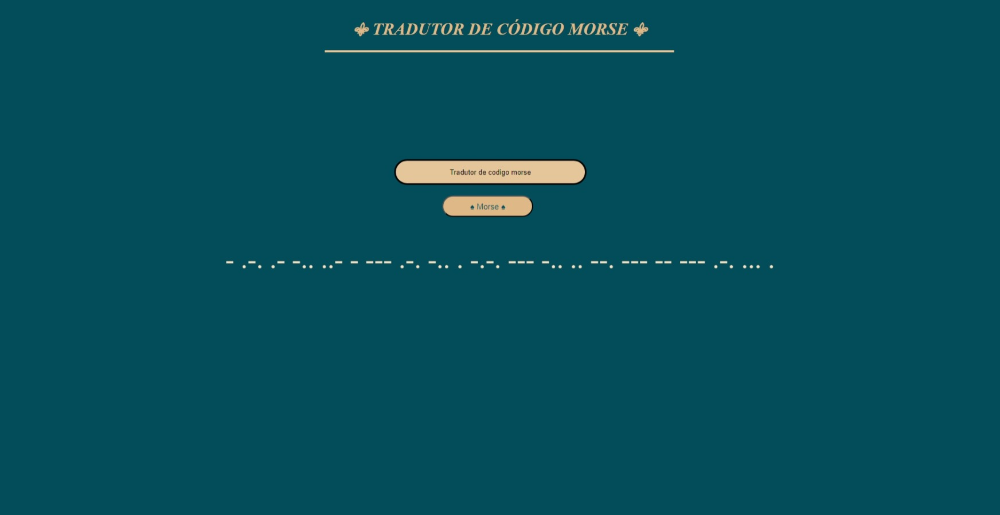

# Codigo-morse_Tradutor
- Code Morse Converter
## Sobre o Projeto

- Esse projeto é um conversor de código morse, onde ele traduz palavras em português para código morse.

## Linguagens

- HTML
- CSS
- JavaScript

## Como testar

- **1.** clone este repositório;
- **2.** Abra com VsCode;
- **3.** Acesse a pasta **código morse** e execute o index.html via Live Server.

# Prints das Telas

## Tela inicial:

## Tela resultado:

